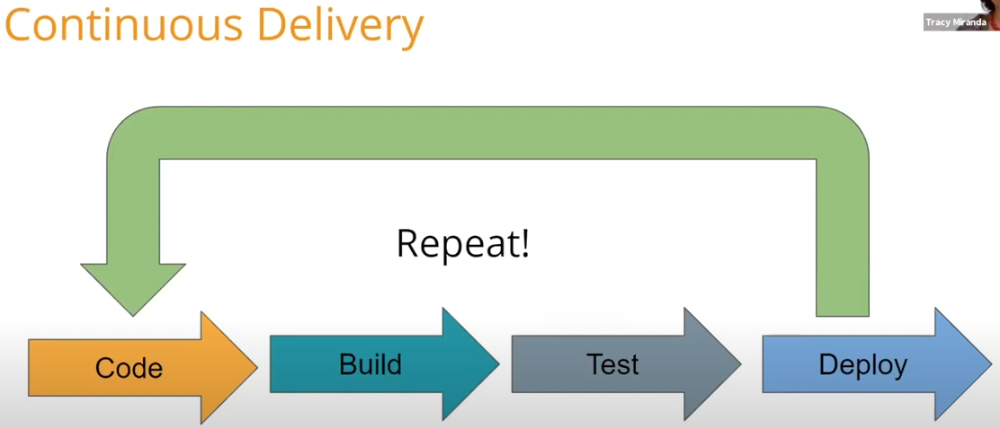
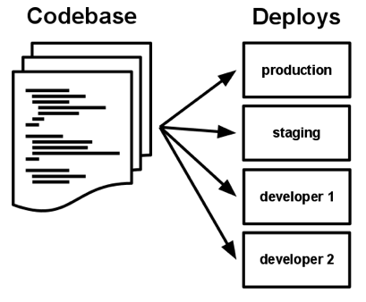
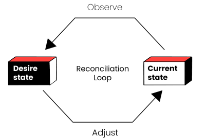

# De l'installation de plugins à la gestion d'une base de code

## Moodle un LMS avec un ecosystem riche

Moodle est un (LMS) open source largement adopté, connu pour sa flexibilité, et ses nombreuses options de personnalisation.
Les fonctionnalités de Moodle peuvent être étendues par des plugins.
Nous avons pres de 2500 plugins dans 40 categories différentes, référencés dans le [répertoire officiel](https://moodle.org/plugins/) développés par la communauté.
Il n'est pas rare de trouver des sites avec plusieurs dizaines,  voire une centaine de plugins installés.

## 2 ou 3 plugins ça va , des dizaines bonjour les dégâts !

Il est possible d'installer des plugins de façon unitaire (interface graphique ou en ligne de commande ), mais il n'y a pas d'outil pour installer une base de code avec des dizaines de plugins.

Les mises à jour de Moodle utilisant des sources sous format .zip  conduisent à faire des mises à jour sur une version existante, ce qui à terme est problématique :
- difficile de restorer une version antérieure
- pas de vue claire de l'historique des mises à jour

La montée de version de Moodle n'est pas des plus simple, ce qui décourage nombre d'entre nous de toujours utiliser les dernières versions: avec pour conséquences, les correctifs de sécurité ne sont pas installés ou installés avec retard.
En réalité, une mise à niveau effectuée trop rapidement ou sans vérification approfondie de la compatibilité des plugins peut parfois s'avérer plus problématique que bénéfique.

en résumé :
- installation des plugins : tâche fastidieuse, coûteuse en temps, non exempte de risques
-  une configuration de site difficilement reproductible
-  la mise à jour d'une nouvelle version de Moodle loin d'être simple

## Code Base Manager

Il faut changer notre vision : passer de l'installation de plugins à gérer une base de code.

**Moodle Code Base Manager** est un outil en ligne de commande qui permet d'installer une liste de plugins et d'effectuer des montées deversions de Moodle.

Le but est d'**automatiser** l'ensemble du process :

📥 Source: Mise à jour du cache local des sources
🔧 Build: Génération de la base de code avec installation des plugins
✅ Test : Tests automatisés pour valider la version.
🚀 Deploiement : L'application est déployé dans un environnenet (pre prod, prod, ...)

Le principal avantage est que le code est prêt à être déployé à tout moment.



## Choix d'architecture

Le projet a été développé en suivant 4 principes :

### . 1 Séparer la génération de la base de code de son environnement de déploiement

Pourquoi ?:

Une même base de code doit pouvoir 
- être déployée dans différents environnements : local, pre-prod, prod,...
- avec des environnements  différents :
    -  au niveau des matériels 
    - de l'infrastructure: serveur bare metal, VM, conteneurs docker, ...
    - de la configuration logicielle (os, logiciels base de données, librairies de test, ...)

Les éléments de configuration liés à l'environnement seront injectés dans la base de code au moment du déploiement. 



### . 2 git comme unique unique de vérité

Tous les élements sont définis par du code.
Les sources seront versionnés sous git:

- le fichier de configuration
- Moodle
- Plugins
- La base de code produite 


Pourquoi ?
Tous les sources des composants sont disponible , ce qui conduit naturellement à tout gérer sous git.
Le versionnage des sources apporte de nombreux avantages notamment:

- une traçabilité de toutes les modifications
- la possibilité de restorer un état antérieur 
- utilisation d'un cache en local  des sources (moodle, plugins) :
  - une amélioration des performances lors des traitements
  - la factorisation des sources : permet d'éviter de multiplier les copies de code lors la gestion de plusieurs instances 

### . 3 un fichier unique de configuration

ce fichier donne l'état attendu de la base de code
Git nous permet de définir un état pour chaque composant :
- la version de Moodle
- la version des plugins

```bash
  moodle:
    version: 4.5+
  plugins:
    moodle-tool_redis:
      source: https://github.com/moodle-an-hochschulen/moodle-tool_redis
      branch: MOODLE_405_STABLE
    moodle-tool_opcache:
      source: https://github.com/moodle-an-hochschulen/moodle-tool_opcache
      branch: MOODLE_405_STABLE

```

Cela simplifie le fonctionnement : le role de l'outil est simplement de réconcilier l'état attendu de la base de code avec celui observé (fonctionnement en mode déclaratif).



### . 4 un résultat versionné et immuable

Le résultat de la génération est un répertoire contenant le code source.
Une nouvelle version complète de la base de code est générée  à chaque fois itération.

Ce résultat est versionné sous git cela permet à tout moment de restorer un état antérieur.

## Les fonctionnalités

L'outil est un script bash composé de différentes commandes exécutables en mode CLI.
Ces commandes sont regroupées dans un menu


### Mise à jour du cache local

La base de code est un assemblage obtenu à partir d'une version de Moodle avec une liste de plugins.
Tous les sources (Moodle, plugins) sont versionnés sous git et maintenus à jour dans un cache en local.

Cela nous apporte:
  - de meilleures performances
  - une factorisation des sources communs à plusieurs instances

#### Import d'un plugin 

L'import d'un plugin se fait en saisissant le nom complet **moodle-type_name** ou de façon abrégée **type_name**
Le script recupére l'url du dépot dans le dépot officiel Moodle et clone le dépot en local.

### Ajout d'un plugin au projet

Sélection des plugins à partir de la liste des plugins présents dans le cache.
Le script recherche une version compatible avec la version de Moodle du projet.

### Génération d'une nouvelle version

une génération complete du source de la base de code est faite apres chaque ajout d'un plugin.
Cette livraison est versionnée sous git et comprend une étiquette de la forme **nom-du-projet-time_stamp**
Cette étiquette peut être utilisée comme déclencheur de tests automatisés. 

## En conclusion

Changement de vision : d'installation de plugins, nous sommes passés à gérer une base de code.

L'automatisation des tâches d'installation et de maintenance offre de nombreux avantages :

- Réduction des erreurs, risques et coûts associés aux tâches et processus manuels
- Possibilité de revenir à un état antérieur
- Documentation automatique de la configuration installée
- Diminution des délais : des opérations de mise à jour qui se chiffraient en heures se mesurent maintenant en minutes

Pour conclure on répondra à la question : Peux t on faire une montée de version en un clic ?