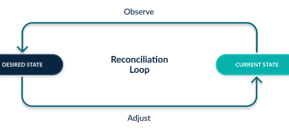

## Mode declaratif

### Imperatif versus declaratif

L'approche déclarative se concentre sur la configuration cible finale ; l'approche impérative se concentre sur la manière pour y parvenir. L'approche déclarative définit l'état souhaité et le système exécute les actions nécessaires pour y parvenir.

Le fichier de configuration définit l'état demandé pour chacun des composants de la base de code :

```
  moodle:
    version: 4.5+
  plugins:
    moodle-tool_redis:
      name: Redis management
      source: https://github.com/moodle-an-hochschulen/moodle-tool_redis
      branch: MOODLE_405_STABLE
    moodle-tool_opcache:
      name: Opcache management
      source: https://github.com/moodle-an-hochschulen/moodle-tool_opcache
      branch: MOODLE_405_STABLE

```
le rôle du script est génerer une nouvelle base de code si l'état demandé est diffrent de l'état observé.
```
  moodle:
    version: 4.5+
  plugins:
    moodle-tool_redis:
      name: Redis management
      source: https://github.com/moodle-an-hochschulen/moodle-tool_redis
      branch: MOODLE_405_STABLE
    moodle-tool_opcache:
      name: Opcache management
      source: https://github.com/moodle-an-hochschulen/moodle-tool_opcache
      branch: MOODLE_405_STABLE

```




Le fonctionnement en mode declaratif