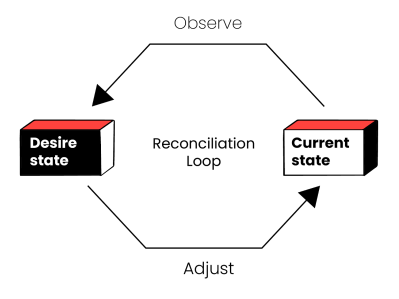

# Préambule

Un outil d'administration en ligne de commande pour aider au déploiement de plugins Moodle via Git , sans utiliser les commades git sous modules.

Vous décrivez la configuration souhaitée dans un fichier au format yaml:

```bash

  moodle:
    version: 4.5+

  plugins:
    moodle-report_benchmark:
      source: https://github.com/mikasmart/moodle-report_benchmark
      branch: master  
    moodle-filter_filtercodes:
      source: https://github.com/michael-milette/moodle-filter_filtercodes
      branch: master
      version: v2.6.1

```    
Le fichier de configuration décrit l'état souhaité de la base de code, à charge pour le script d'amener la base de code à l'état demandé. 



Le changement d'état peut avoir plusieurs origines:
- le dépot Moodle contient de nouveaux commits 
- correction d'un plugin installé
- ajout, suppression d'un plugin dans le projet
- ...

Cela permet de gérer :
- la base de code son état initial
- son évolution (historique des versions)

A tout moment l'utilisation de git permet de recréer un état de la base de code.


### Pour démarrer

depuis le répertoire d'installation

```bash
  cd ~/adele
  ./adele

```
l'outil permet plusieurs instances de code :

Nommez le projet: demo
A chaque projet est associée un base de code.
L'outil peut gérer plusieurs projets. 
La création d'un projet entraine une mise à jour d'un clone du dépot Moodle (cache local)
Le fichier de configuration de la base de code s'affiche

Il comporte:
- la version source de Moodle 
- la liste des plugins à installer (la liste est vide au démarrage)

### Version de Moodle
La version Moodle est précisée lors de la création du projet.
L'option définie ici est 4.5+
cela designe la derniere version mineure de Moodle disponible avec les dernieres mises à jour hebdomadaires.
Il est possible de définir une version figée : 4.5.1 par exemple.
Les différentes options du fichier de configuration sont détaillées [ici](../reference/conf.md)

## Mise à jour des Plugins additionnels
2 étapes :
- mettre à jour le depot des plugins (cache local)
- ajouter le plugin au projet

### Mise à jour du cache des plugins

Choisissez dans le menu **Import d'un plugin**

A partir du nom saisi par l'administrateur l'outil va chercher des information dans le répertoire officiel des plugins agréés par Moodle.
On récupere
- la description
- la source du dépot git
- la version 

le dépot du plugin est cloné en local (mise à jour du cache)

Moodle HQ n'a pas codifié de façon précise comment est géréela gestion des versions des plugins, ce qui fait qu'il existe différentes pratiques.

l'outil propose une version, et laisse à l'administrateur la possibilité de modifier cette proposition. 

nota: le cache des plugins est partagé par toutes les instances de base de code (factorisation).

nota : il est possible de choisir un plugin qui n'est pas dans le répertoire officiel en mettant à jour directement le fichier de configuration.

### Mise à jour de la configuration

En lançant la commande : **Ajout d'un plugin au projet**

L'outil présente la liste des plugins présents dans le cache
L'administrateur sélectionne les plugins à intéfrer dans la base de code
Le script récupere l'url du depot git du plugin

dans le fichier de configuration 2 parametres obligatoires:
- source : url du depôt git du mainteneur
- version : version du plugin à utiliser, doit être compatible avec la version Moodle

La version peut être :
- une branche 
- une étiquette (tag)
- un commit   

Pour agréer un plugin Moodle demande au développeur d'indiquer un dépot git (la plupart du temps github), dêtre compatible avec au moins 1 version maintenue,  mais n'a pas préciser comment gerer la dépendance avc les versions Moodle. 
Ce qui fait que plusieurs paratqiues co existent :
- une branche unique 
- un branche pour chaque version Moodle
Le script détermine la version du plugin compatible avec la version Moodle, mais laisse la possibilté à 'administrateur de modifier cette proposition.
